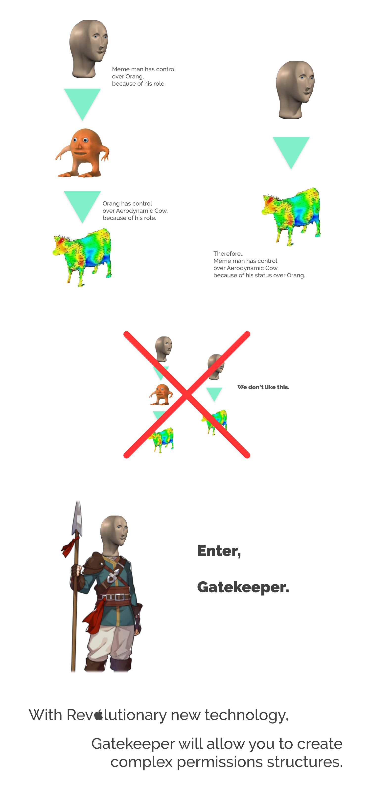

# Gatekeeper Bot

Submission for Discord Hack Week 2019.

Gatekeeper is a moderation bot that will help you structure permissions for sub communities.

## DISCLAIMER

This project was supposed to be much more extensive!! Unfortunately there's only so much you can do in a five day period. The vision for this project is that it encapsulates all permission possibilities of Discord, and not just adding/removing people from roles (which is all it is now). Additionally, a web interface to create and manage GK Roles instead of entering commands one by one *like an animal*.

With that out of the way, please direct your attention to this poorly designed, uninformative poster. And below that, the more informative help you can find when using the bot.

> Hello! I'm Gatekeeper, GK for short.
> 
> What do I do? I allow admins of your server to create GK Roles. GK Roles are a lot like regular Discord roles, but they allow some more interesting permissions configurations.
> 
> The most common scenario to use a GK Role would be when creating a custom channel collection for users of a specific sub community. You want to allow new members to come and go as they please, without having to manually assign them those roles. And, for moderation, you want to grant a specific set of trustworthy people the ability to remove any members from ONLY that role, if they have been misbehaving.
> 
> So if you're an administrator, get started! If you're not, tell the admin about this message!
> 
> Here are some commands.
> 
> **Legend**
> 
> Any time you see `<>` in a command, it means you must input text there, omitting the `<` and `>` characters.
> 
> If a type of input must be a mention (user mention, role mention, channel mention), I will specify.
> 
> Any time you see `<> [<>, ...]` in a command, it means you can provide one or more of that type of input at once.
> 
> **General Commands**
> *You must be in a gk role to use these*
> 
> `gk invite <user mention> [<user mention>, ...] to <gk role>`
> *Invite a friend to a gk role.*
> 
> `gk leave <gk role>`
> *Leave a gk role.*
> 
> `gk list permsets for <gk role>`
> *Lists all permsets of a gk role.*
> 
> **Admin Commands**
> *You must have extended permissions to use these*
> 
> `gk create role named <gk role>`
> *Create a gk role with the specified name.*
> 
> `gk delete role named <gk role>`
> *Delete a gk role of the specified name.*
> 
> `gk create permset named <permset> for <gk role>`
> *Create a permset for a gk role.*
> 
> `gk update permset named <permset> for <gk role>`
> *Update a permset for a gk role.*
> 
> `gk delete permset named <permset> for <gk role>`
> *Delete a permset for a gk role.*
> 
> `gk grant permset named <permset> for <gk role> to <user mention> [<user mention>, ...]`
> *Grant a user a new permset status in a gk role.*

[Add Gatekeeper to your server](https://discordapp.com/api/oauth2/authorize?client_id=592765377210220582&permissions=268437568&scope=bot)

Written by [Mateja Lasan](https://github.com/matootie) and [Stephen Edwards](https://github.com/sventi555)

